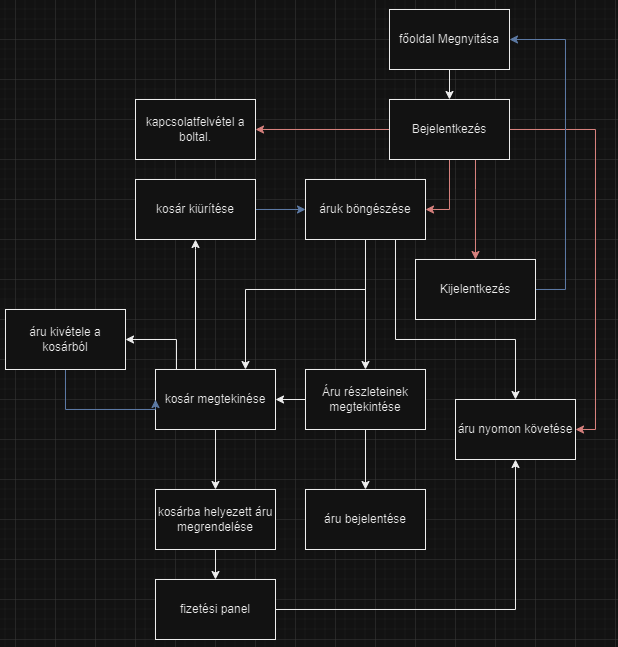

## 1. A rendszer célja

A Kézifék Entertaiment Inc. azt kapta megbízásul, hogy készítsen egy középkort idéző webshopot, mely kitűnik a ma fellelhető webshopok közül a minőségre helyezett hangsúlyával, és egyedi, autentikus, kézzel készült termékeivel, a tömegből kitűnő webdesignal. A Kézifék E. Inc. elkötelezett amellett, hogy a Jókapás webshop kielégítse a középkori kultúrák szerelmeseinek minden igényét, mindezt a korhoz leghitelesebben kinéző felületen keresztül. Nem csak egy áruházat akarunk létrehozni, hanem egy olyan helyet, ahol az emberek igazán átélhetik azt a varázslatos világot, ami akkoriban volt. Ez a projekt az általunk kifejlesztett egyedi és kreatív megoldásokkal fogja elősegíteni, hogy új szintre emeljük a középkori kultúrák iránt érdeklődő vásárlók elérését. Felhasználóink könnyen létre tudnak hozni a kézzel készült,korhű árúinak aukciókat, ahol nem kell aggódniuk a adásvétel és a kiszállítás bonyodalmaitól. Hogy oldalunk a lehető legmagasabb színvonalat képviselhesse, az árúkat be lehet nekünk jelenteni, ahol kiválasztható a probléma típusa az árúval, mely után a moderátorok aktívan bevizsgálhatják az így megjelölt árúkat. Oldalunk teljeskörű pénzvisszafizetési garanciát vállal az oldalon megvett árúkra, ha azok nem autentikusak, nem felelnek meg a leírásnak, vagy nem kézzel készült darabok.

## 2. Projektterv
   
### 2.1 Projektszerepkörök, felelőségek
* Scrum master:
	-   Kaponya Martin 	
* Product owner:
	-   Kaponya Martin 
* Üzleti szereplő:
	-   Megrendelő:
		 -  Bagoly Gábor

### 2.2 Projektmunkások és felelőségek

* Frontend:
	-   Pántya Barnabás
	-   Fodor Győző Benedek
* Backend:  
	-   Herbák Marcell
	-   Détári Levente
* Tesztelés:   
	-   Herbák Marcell
	-   Pántya Barnabás
	-   Détári Levente
	-   Fodor Győző Benedek

### 2.3 Ütemterv

|Funkció                  | Feladat                   | Prioritás | Becslés (nap) | Aktuális becslés (nap) | Eltelt idő (nap) | Határidő (nap)      |
|-------------------------|---------------------------|-----------|---------------|------------------------|------------------|---------------------|
|Követelmény specifikáció |Megírás                    |         1 |             1 |                      1 |                1 |                   1 |             
|Funkcionális specifikáció|Megírás                    |         1 |             1 |                      1 |                1 |                   1 |
|Rendszerterv             |Megírás                    |         1 |             1 |                      1 |                2 |                   2 |
|Front End                |Vizuális tervek elkészítése|         2 |             1 |                      1 |                1 |                   1 |
|Front End                |Prototípus elkészítése     |         2 |             3 |                      3 |                3 |                   5 |
|Front End                |Alapfunkciók elkészítése   |         2 |             2 |                      2 |                2 |                   2 |
|Back End                 |Prototípus elkészítése     |         3 |             5 |                      5 |                0 |                   5 |
|Back End                 |Alapfunkciók elkészítése   |         3 |             3 |                      3 |                0 |                   3 |
|Front End                |Termék funkciók elkészítése|         4 |             5 |                      5 |                0 |                   5 |
|Back End                 |Termék funkciók elkészítése|         4 |             5 |                      5 |                0 |                   5 |
|Front- és Back End       |Ügyfélszolgálat elkészítése|         5 |             2 |                      2 |                0 |                   2 |
|Front- és Back End       |Tesztelés                  |         6 |             2 |                      2 |                0 |                   2 |

### 2.4 Mérföldkövek

   *   10.28. Követelmény specifikáció elkészítése
   *   10.30. Funkcionális specifikáció elkészítése
   *   11.05. Rendszerterv elkészítése
   *   11.14. Bejelentkező prototípusoldal elkészítése
   *   11.15. I. Sprint Prototípus prezentálása
   *   11.29. Alpha tesztelések megkezdése
   *   12.12. Utolsó simítások és tesztelések
   *   12.13. II. Sprint végső prototípus bemutatása
   
## 3. Üzleti folyamatok modellje

### 3.1 Üzleti szereplők

Az oldal regisztráció nélkül használható, korlátozásokkal. Az oldalon lévő árucikkek megtekinthetőek, kosárba lehet rakni őket, viszont megvásárláshoz, csomagkövetéshez, és árufeltöltéshez regisztrálni kell az oldalra.

### 3.2 Üzleti folyamatok

A felhasználó az oldal megnyitása után használhatja az árukat kilistázó oldalt, a kosarat, a termékekről részletesebb információt adó áruoldalt, és a kapcsolattartási oldalt. Bejelentkezés után lehetősége lesz a felhasználónak a terméket megvásárolni, a csomagkövetést elérni, illetve az árukat bejelenteni.
   
## 4. Követelmények

### Funkcionális követelmények

| ID | Megnevezés               | Leírás                                                                                                                                                     |
|----|--------------------------|------------------------------------------------------------------------------------------------------------------------------------------------------------|
| K1 | Bejelentkezési oldal     | Egyes funkciók elérése előtt ezen az oldalon kell azonosítania magát a felhasználónak mielőtt elérhetné azt.                                               |
| K2 | Kijelentkezési oldal     | Biztonsági okokból itt jelentkezhet ki a fiókjából a felhasználó.                                                                                          |
| K3 | Termékböngésző           | A felhasználó itt láthatja az oldalon megtalálható termékek választékát, itt tudja kosárba rakni, vagy a termékspecifikus oldalt elérni.                   |
| K4 | Termékspecifikus oldal   | Itt a felhasználó részletesebb leírást kaphat egyes az oldalon megtalálható termékekről, itt tudja kosárba rakni a terméket vagy bejelenteni ellenőrzésre. |
| K5 | Kosár                    | A felhasználó ezen az oldalon láthatja az álltala kijelölt termékeket, innen tud tovább menni a rendelés leadására.                                        |
| K6 | Bejelentő oldal          | A felhasználó itt tudja kiválasztani bejelentési szándékának indokát, itt tudja elküldeni a moderátoroknak.                                                |
| K7 | Kapcsolatfelvételi oldal | Itt tud a felhasználó emailt írni az oldal karbantartójának.                                                                                               |
| K8 | Regisztrációs oldal      | A felhasználó ezen az oldalon tudja megadni az adatait, amik szükségesek egyes funkciók eléréséhez.                                                        |
| K9 | Csomagkövetés oldal      | A felhasználó itt láthatja csomagjának az állapotás, és a várható szállitási dátumot.                                                                      |

### Nemfunkcionális követelmények

| ID  | Megnevezés                             | Leírás                                                                                                 |
|-----|----------------------------------------|--------------------------------------------------------------------------------------------------------|
| K10 | Középkort idéző autentikus oldaldesign | Maga az oldal designja, a színek, a betűk, minden egy lovagi torna hangulatát idézi.       |
| K11 | átlátható, könnyen kezelhető felület   | Az oldalak könnyen használhatóak legyenek, átláthatóak legyenek, intuitívak, és ne legyenek zsúfoltak. |
   
## 5. Funkcionális terv
    
### 5.1 Rendszerszereplők

A rendszer egy szerver (host) gépen fut, amelyet a felhasználók (kliensek) egy webböngészőn keresztül érik el. A felhasználók között több jogosultság is megoszlik, ezek:

| Felhasználói jogkör | Jogok                                                                                                                                                                                                                   |
|---------------------|-------------------------------------------------------------------------------------------------------------------------------------------------------------------------------------------------------------------------|
| no_login            | Regisztráció és bejelentkezés, Áruk megtekintése                                                                                                                                                                        |
| user                | Áruk megtekintése és megvásárlása, Saját rendelés leadása, törlése és követése, saját profil szerkesztése és törlése, Saját áru eladása és törlése, Értékelés írása a vásárolt termékre, Ügyfélszolgálati segítségkérés |
| moderator           | user + Értékelések törlése, Áruk törlése, Ügyfélszolgálati segítségnyújtás                                                                                                                                              |
| admin               | moderator + delivery + Rendelések törlése, Profilok törlése, Ügyfélszolgálati esemény törlése                                                                                                                           |
| delivery            | Rendelések állapotának módosítása                                                                                                                                                                                       |
   
### 5.2 Menü-hierarchia:
 * Jókapás Felület: 
	- Felhasználó
		- Kínálat böngészése
		- GYIK oldal megtekintése
		- Bejelentkezés
	- Belépett felhasználó
		- Kínálat böngészése
		- Ügyfélszolgálat felkeresése
		- GYIK oldal megtekintése
		- Profil szerkesztése
		- Rendelés leadása
		- Értékelés írása
		- Saját rendelés törlése
  		- Saját profil törlése
	- Moderátor felhasználó
		- Értékelések törlése
		- Ügyfélszolgálati kérdések válaszolása
	- Admin felhasználó
		- Felhasználók törlése
		- Tételek törlése
		- Értékelések törlése
		- Ügyfélszolgálati kérdések válaszolása
		- Rendelések törlése
 * Futárszolgálat Felület: (csak futárszolgálatnak elérhető)
	- Az oldal csak "delivery", azaz futárszolgálatnak elérhető bejelentkezés után
 		- Rendelések böngészése
 		- Rendelések állapotának szerkesztése
   
## 6. Fizikai környezet

### Vásárolt szoftverkomponensek, valamint esetleges külső rendszerek
Nincsenek vásárolt szoftverkomponensek.
### Hardver topológia
Olyan grafikus felülettel rendelkező operációs rendszer alkalmas, amely tud böngészőt futtatni.
### Fizikai alrendszerek
Kliens gépek: A követelményeknek megfelelő, grafikus felülettel rendelkező operációs rendszerrel rendelkező PC-k.
Szerver (Host) gép: Az adatbázis rendszer és a weboldalhoz szükséges összetevők itt találhatóak. A kliens gép ezzel kommunikál.
### Fejlesztő eszközök
Visual Code
Böngésző (Google Chrome, Firefox, Opera, Brave, Safari)
    
## 7. Architekturális terv

A szolgáltatás igénybevételéhez szükséges az állandó internetkapcsolat és webböngésző (Google Chrome, Firefox, Opera, Brave, Safari). A felhasználónak az adatbázishoz nem szükséges külön csatlakoznia, a weboldal háttérben autómatikusan elvégzi.

Az oldal használatához el kell indítani a webböngészőt, a keresősávjába bele kell írnia a Jókapás URL címét, ezután igénybe veheti a szolgáltatásokat.
    
## 8. Adatbázis terv

A webshop több különböző táblát használ a megfelelő működés érdekében, ezek: 

| Tábla    | Betöltendő funkció                         | Tábla attribútumai                                                         |
|----------|--------------------------------------------|----------------------------------------------------------------------------|
| Users    | A regisztrált felhasználók adatait tárolja | userID, username, password, email, full_name, icon, 2FA                           |
| Products | A feltöltött termékek adatait tárolja      | productID, product_tag, product_name, description, sellerID, isUnavailable |
| Orders   | A vásárolt termékeket tárolja              | orderID, productID, sellerID, userID, status                               |

## 9. Implementációs terv

React.js kezeli a backend és frontendet, illetve az adatbázist.
    
## 10. Tesztterv

A tesztelések célja a rendszer és komponensei funkcionalitásának teljes vizsgálata,
ellenőrzése a rendszer által megvalósított üzleti szolgáltatások verifikálása.
A teszteléseket a fejlesztői csapat minden tagja elvégzi.
A tesztek eredményeit a tagok dokumentálják külön fájlokba.

A tesztelés során a szoftver megfelelő működését vizsgáljuk. Amennyiben az elvártnak megfelelő eredményt kapunk, a teszt eset sikeresnek tekinthető, ellenkező esetben a hibát rögzítjük a teszt jegyzőkönyvben. Ezt követően a megtalált hibákat javítjuk a szoftverben, és újbóli tesztelésnek vetjük alá a rendszert.

A tesztelés során különböző operációs rendszereken (IOS, Android, Windows) és különböző böngészőkben (Chrome, firefox, Opera, Safari, Brave) vizsgáljuk az oldal megfelelő működését.

## 11. Telepítési terv

Az oldal nem igényli bármiféle szoftvernek a telepítését, bármely elterjedt böngészőből elérhető az oldal.

Szükségünk van az oldal eléréséhez egy internet eléréssel rendelkező IOS, android, linux, Windows, vagy MacOS-t futtató eszközre, és az azon lévő internetböngészésre alkalmas böngészőalkalmazásra.
    
## 12. Karbantartási terv

Fontos ellenőrizni:
*	Az oldal kritikus információi nem elérhetők az arra nem felhatalmazott felhasználók számára. Ilyenek például a fizetési adatok, bejelentkezési adatok, és az oldalon lévő termékek adatai.
*	Felhasználói visszajelzéseket az oldallal kapcsolatban, ezeket mielőbb javítani kell.
*	A felhasználók álltal tett árubejelentéseket a moderátoroknak ellenőriznie kell.

